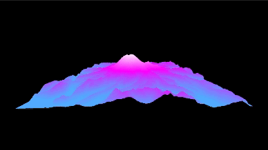

# create3dterrainmaps

An advanced web tool to create, visualize, and export custom 3D terrain maps in real-time.

## Features

- **Interactive Map Interface**: Select and capture terrain areas using an intuitive map interface powered by OpenLayers.
- **Real-Time 3D Visualization**: Transform captured terrain images into interactive 3D models using Three.js.
- **Customizable Terrain Editing**: Adjust black and white levels, gamma correction, and color gradients to fine-tune terrain details.
- **Export Options**: Export the captured terrain images and 3D models for use in other applications.
- **Responsive Design**: Accessible on various devices with an optimized user experience.

## Demo


[Live Demo](https://create3dterrainmaps.vercel.app/)

## Installation

1. **Clone the repository:**

   ```bash
   git clone https://github.com/j03rul4nd/create3dterrainmaps.git
   ```

2. **Navigate to the project directory:**

   ```bash
   cd create3dterrainmaps
   ```

3. **Install dependencies:**

   ```bash
   npm install
   ```

4. **Start the development server:**

   ```bash
   npm run dev
   ```

5. **Open your browser and navigate to:**

   ```
   http://localhost:3000
   ```

## Usage

- **Capture Terrain:**

  - Navigate the map to your area of interest.
  - Click the **"Capture Terrain"** button to capture the terrain image.

- **Adjust Terrain Image:**

  - Use the sliders to adjust black level, white level, and gamma correction.
  - Preview the changes in real-time.

- **Generate 3D Terrain:**

  - Click the **"Generate 3D Terrain"** button to create the 3D model from the adjusted image.

- **Export Options:**

  - **Export Image**: Save the adjusted terrain image as a PNG file.
  - **Export 3D Model**: Download the 3D terrain model in GLTF format.


## Contributing

Contributions are welcome! Please read the [contributing guidelines](CONTRIBUTING.md) before getting started.

## License

This project is licensed under the MIT License - see the [LICENSE](LICENSE) file for details.

## Author

- **Joel Benitez**

  - [LinkedIn](https://www.linkedin.com/in/joel-benitez-iiot-industry/)
  - [Portfolio](https://joelbenitez.onrender.com/)

